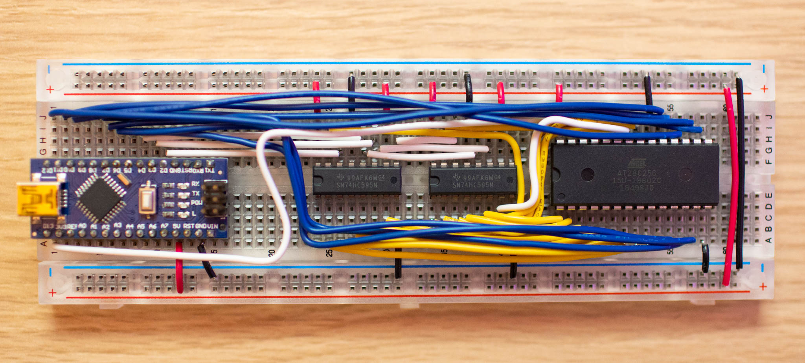

# at28c256

An Arduino sketch and associated Python library for programming [AT28C256 EEPROMs](https://www.microchip.com/en-us/product/AT28C256), based heavily on a circuit designed by [Ben Eater](https://github.com/beneater/eeprom-programmer).

## Programmer Board



Above is my board - see [Ben's schematic](https://raw.githubusercontent.com/beneater/eeprom-programmer/master/schematic.png) for details, and read the [AT28C256 Data Sheet](https://ww1.microchip.com/downloads/en/DeviceDoc/AT28C256-%E2%80%93-Industrial-Grade-256-Kbit-(32,768-x-8)-Paged-Parallel-EEPROM.pdf) for programming pins/sequence/timing.

Simply: the [Arduino Nano](https://www.arduino.cc/en/pmwiki.php?n=Main/ArduinoBoardNano) writes the 8 data lines directly (pins 5-12), whilst address is fed via two [74HC595 Shift Registers](https://www.ti.com/lit/ds/symlink/sn74hc595.pdf).

## Usage

1. Compile and upload the Arduino Sketch.
2. Setup the Python package in a clean virtual environment:
```
    > py -3 -m venv venv
    > . ./venv/Scripts/activate
    > python -m pip install --upgrade setuptools pip
    > pip install -e .
```
3. See `scripts/dump.py` and `scripts/zero.py` for detailed usage.